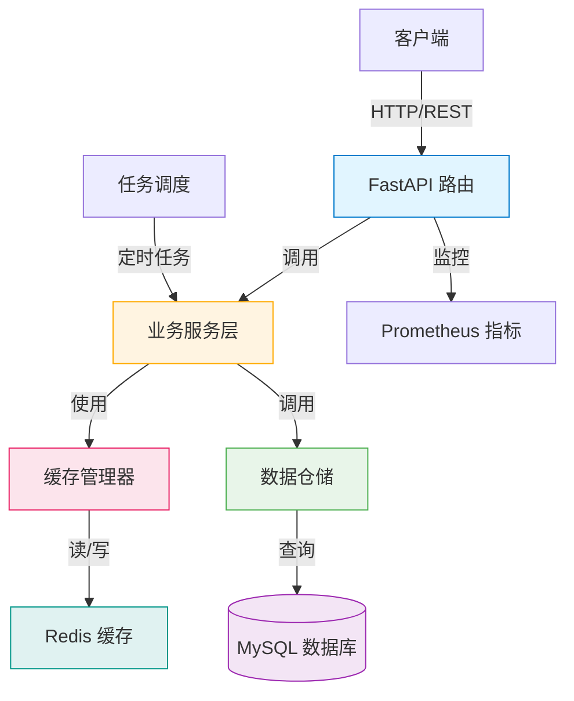
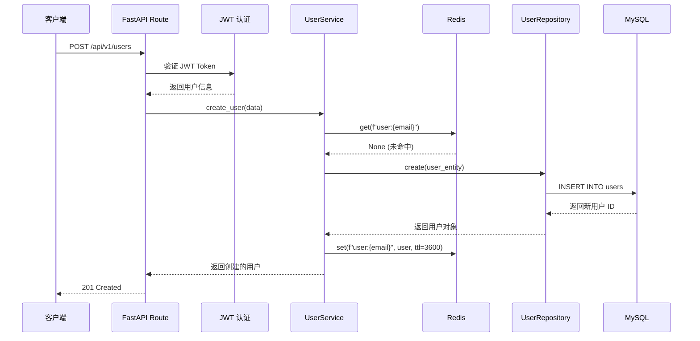
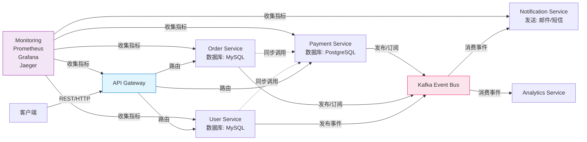
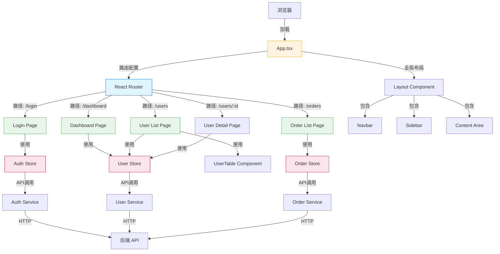
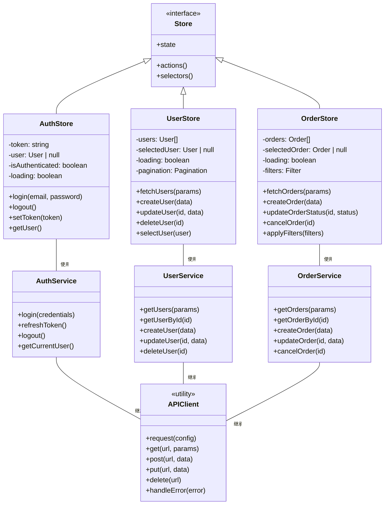
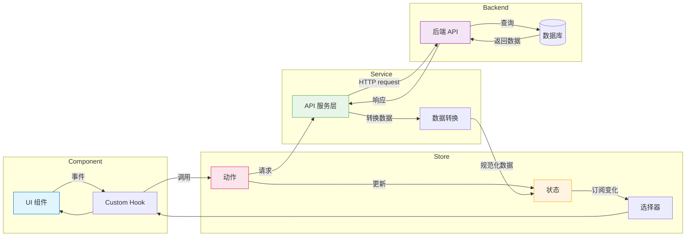

# 架构分析器 - 扩展示例

## 示例 1: 完整的 FastAPI 项目架构分析

### 背景
分析一个类似本项目的 FastAPI 企业级应用。

### 执行命令
```
分析这个项目的整体架构
```

### 预期输出

#### 项目概览
- **技术栈**: FastAPI 0.112.0, SQLAlchemy 2.0 (Async), MySQL, Redis, pytest
- **架构风格**: 分层架构 + 仓储模式 + 服务层
- **Python 版本**: 3.9+

#### 项目结构
```
src/pythonprojecttemplate/
├── api/                   # API 层: 路由、请求/响应模型
│   ├── routes/           # 路由定义
│   ├── middleware/       # 中间件（异常处理、监控）
│   └── dependencies/     # FastAPI 依赖注入
├── cache/                # 缓存系统: Redis + 内存缓存
│   ├── manager.py        # 缓存管理器
│   ├── memory_impl.py    # 内存缓存实现
│   └── redis_impl.py     # Redis 缓存实现
├── config/               # 配置管理: YAML + Pydantic
│   ├── settings.py       # 配置模型
│   └── config.yaml       # 配置文件
├── core/                 # 核心基础设施
│   ├── constants.py      # 常量定义
│   ├── exceptions.py     # 异常定义
│   └── security/         # 安全（JWT、加密）
├── db/                   # 数据库层
│   ├── base.py           # SQLAlchemy 基础配置
│   ├── session.py        # 会话管理
│   └── migrations/       # Alembic 迁移
├── modules/              # 业务模块
│   ├── auth/             # 认证授权模块
│   ├── user/             # 用户管理模块
│   └── base.py           # 模块基类
├── repositories/         # 数据访问层: 仓储模式
│   ├── base_repository.py
│   └── user_repository.py
├── scheduler/            # 任务调度: APScheduler
│   └── tasks.py
├── monitoring/           # 监控: Prometheus 指标
│   └── metrics.py
├── plugins/              # 插件系统
│   └── loader.py
└── utils/                # 工具函数
    ├── logger.py
    └── helpers.py
tests/                    # 测试
├── framework/            # 框架层测试
├── modules/              # 模块测试
└── business/             # 业务场景测试
dependencies/             # 依赖管理
scripts/                  # 脚本文件
docs/                     # 文档
```

#### 架构分析

**架构风格**: 分层架构 + 仓储模式



**关键设计模式**:

1. **仓储模式 (Repository Pattern)**: `src/repositories/`
   - 抽象化数据访问逻辑
   - 每个模型对应一个仓储类
   - 支持异步操作

2. **依赖注入 (Dependency Injection)**: `src/api/dependencies/`
   - FastAPI 的 Depends 机制
   - 数据库会话、缓存、认证注入

3. **工厂模式 (Factory Pattern)**: `src/cache/manager.py`
   - 根据配置创建 Redis 或内存缓存
   - 平滑降级策略

4. **策略模式 (Strategy Pattern)**: 缓存实现
   - RedisCache 和 MemoryCache 实现统一接口
   - 运行时切换策略

5. **模块模式 (Module Pattern)**: `src/modules/`
   - 按业务功能组织代码
   - 每个模块包含模型、服务、路由

**数据流示例**:



**架构优点**:

1. ✓ **清晰的层次结构**: api → modules → repositories → db
2. ✓ **关注点分离**: 每层的职责明确
3. ✓ **可测试性**: DI 便于 mock，每层的测试简单
4. ✓ **可扩展性**: 模块和插件系统支持功能扩展
5. ✓ **灵活性**: 支持多数据库、缓存可插拔
6. ✓ **可观测性**: Prometheus 指标、结构化日志

**改进建议**:

1. **优先级: 高** - 添加 API 限流（Rate Limiting）
   - 防止 API 滥用
   - 保护后端服务
   - 使用 Redis 实现滑动窗口

2. **优先级: 中** - 实现 CQRS 模式
   - 对于读操作频繁的场景
   - 使用不同策略优化读/写
   - 提高可扩展性和性能

3. **优先级: 中** - 添加 API 版本管理
   - 更明确的版本化策略
   - 支持多版本并存
   - 平滑迁移

4. **优先级: 低** - 实现事件驱动模块
   - 使用消息队列（RabbitMQ/Kafka）
   - 解耦模块间通信
   - 支持异步处理

5. **优先级: 低** - 添加 API 文档认证
   - 保护 Swagger UI
   - 防止生产环境暴露

## 示例 2: 微服务项目架构分析

### 项目结构
```
microservices-project/
├── docker-compose.yml          # 编排服务
├── api-gateway/                # API 网关
│   ├── src/
│   └── Dockerfile
├── user-service/               # 用户服务
│   ├── src/
│   ├── requirements.txt
│   └── Dockerfile
├── order-service/              # 订单服务
│   ├── src/
│   ├── requirements.txt
│   └── Dockerfile
├── payment-service/            # 支付服务
│   ├── src/
│   └── Dockerfile
├── notification-service/       # 通知服务
│   ├── src/
│   └── Dockerfile
├── shared/                     # 共享库
│   ├── models/                 # 共享模型
│   └── utils/                  # 共享工具
├── event-bus/                  # 事件总线配置
│   └── kafka/                  # Kafka 配置
└── infrastructure/             # 基础设施配置
    ├── monitoring/             # Prometheus, Grafana
    └── logging/                # ELK Stack
```

### 架构图



### 通信模式

1. **同步通信**（REST API）
   - API 网关到各服务
   - 服务间必要时的同步调用
   - HTTP/2 或 gRPC

2. **异步通信**（事件驱动）
   - 通过 Kafka 发布/订阅事件
   - 解耦服务依赖
   - 提高系统弹性

3. **事件示例**
   - `user.created` - 新用户注册
   - `order.created` - 创建新订单
   - `order.paid` - 订单支付完成
   - `payment.failed` - 支付失败

### 架构质量评估

**优点**: ✓
- 服务自治，独立部署
- 技术栈灵活（不同服务可用不同语言）
- 故障隔离（单个服务故障不影响整体）
- 可扩展性强（按需扩展特定服务）
- 团队组织灵活（按服务划分团队）

**挑战**: ⚠️
- 分布式事务管理复杂
- 数据一致性保证（最终一致性）
- 服务间通信开销
- 调试和监控难度增加
- 部署和运维复杂度高

**改进建议**:

1. **实现分布式链路追踪**
   - 集成 OpenTelemetry
   - 使用 Jaeger 查看调用链
   - 快速定位性能瓶颈

2. **实现熔断和降级**
   - 使用 Resilience4j 或类似库
   - 防止级联故障
   - 提高系统弹性

3. **统一配置管理**
   - 使用 Consul/etcd
   - 集中管理配置
   - 支持动态配置更新

4. **服务网格（Service Mesh）**
   - 考虑 Istio 或 Linkerd
   - 统一管理服务通信
   - 提供流量管理、安全、可观测性

## 示例 3: 分析 JavaScript 前端项目

### 项目信息
- **框架**: React 18 + TypeScript
- **状态管理**: Zustand
- **路由**: React Router v6
- **UI 库**: MUI (Material-UI)
- **构建工具**: Vite

### 项目结构
```
frontend/
├── public/
├── src/
│   ├── App.tsx                 # 根组件
│   ├── main.tsx                # 入口文件
│   ├── routes/                 # 路由配置
│   │   ├── index.tsx
│   │   ├── PrivateRoute.tsx    # 私有路由保护
│   │   └── lazyLoad.tsx        # 懒加载组件
│   ├── pages/                  # 页面组件
│   │   ├── Login/
│   │   ├── Dashboard/
│   │   ├── Users/
│   │   └── Orders/
│   ├── components/             # 共享组件
│   │   ├── Layout/             # 布局组件
│   │   ├── DataTable/          # 数据表格
│   │   ├── Form/               # 表单组件
│   │   └── Loading/            # 加载状态
│   ├── store/                  # 状态管理
│   │   ├── useAuthStore.ts     # 认证状态
│   │   ├── useUserStore.ts     # 用户管理
│   │   └── useOrderStore.ts    # 订单管理
│   ├── hooks/                  # 自定义 Hook
│   │   ├── useApi.ts           # API 调用封装
│   │   ├── useForm.ts          # 表单处理
│   │   └── useDebounce.ts      # 防抖 Hook
│   ├── services/               # API 服务层
│   │   ├── apiClient.ts        # Axios 封装
│   │   ├── authService.ts      # 认证服务
│   │   ├── userService.ts      # 用户服务
│   │   └── orderService.ts     # 订单服务
│   ├── types/                  # TypeScript 类型定义
│   │   ├── user.ts
│   │   ├── order.ts
│   │   └── api.ts
│   ├── utils/                  # 工具函数
│   │   ├── formatDate.ts
│   │   └── validators.ts       # 表单验证
│   └── assets/                 # 静态资源
├── package.json
├── vite.config.ts
└── tsconfig.json
```

### 组件结构图



### 状态管理架构

**Zustand Store 示例**:



### 数据流向



### 性能优化建议

1. **代码分割（Code Splitting）**
   - 使用 React.lazy() 懒加载页面组件
   - 按路由分割代码
   - 减少初始 bundle 大小

2. **缓存策略**
   - 使用 React.memo 优化组件重渲染
   - 使用 useMemo/useCallback 缓存计算结果
   - 合理使用 Zustand 选择器，避免全局重渲染

3. **API 优化**
   - 实现请求防抖（debounce）
   - 合并多个请求（数据聚合）
   - 使用 SWR 或 React Query 管理服务器状态

4. **图片和资源优化**
   - 使用 WebP 格式
   - 实现图片懒加载
   - 压缩静态资源

5. **构建优化**
   - 使用 Vite 的代码分割
   - 开启 Gzip/Brotli 压缩
   - 使用 CDN 加速静态资源
