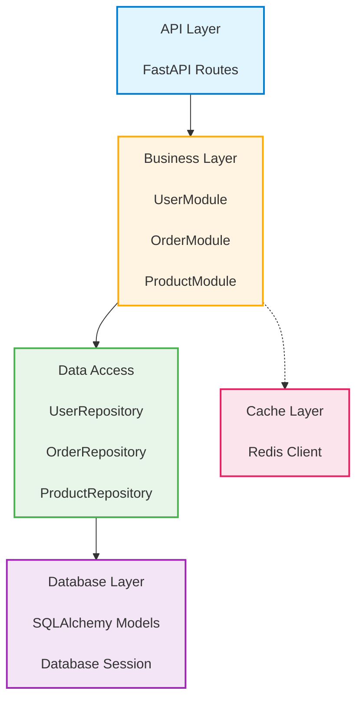
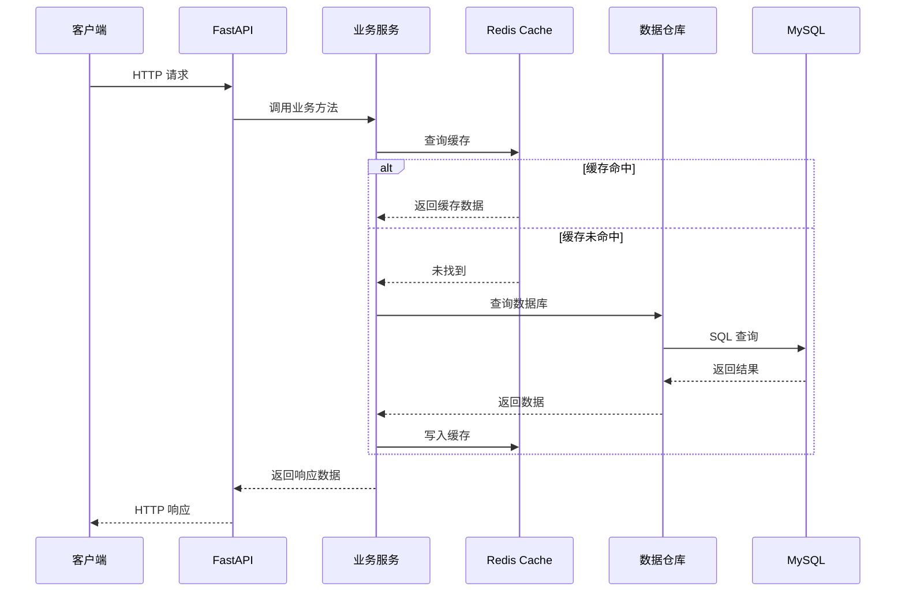
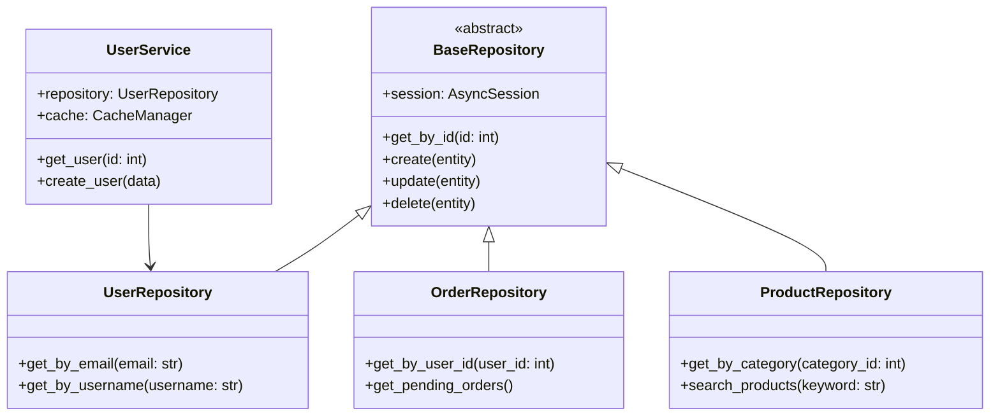

# 架构分析器 - 详细参考

## 架构模式识别指南

### 1. 分层架构（Layered Architecture）

**识别标志**：
```
project/
├── presentation/      # UI 层
├── business/          # 业务逻辑层
├── data-access/       # 数据访问层
└── database/          # 数据存储层
```

**关键特征**：
- 清晰的层级边界
- 单向依赖（上层依赖下层，下层不依赖上层）
- 每一层有明确职责

**FastAPI 示例**：
```
src/
├── api/               # 表现层：HTTP API、请求/响应模型
├── modules/           # 业务层：领域逻辑、服务
├── repositories/      # 数据访问层：CRUD 操作
└── db/                # 数据层：ORM 模型、数据库连接
```

### 2. 六边形架构（Hexagonal Architecture / Clean Architecture）

**识别标志**：
```
project/
├── domain/            # 核心业务逻辑
│   ├── entities/
│   ├── services/
│   └── repositories/
├── application/       # 用例/应用服务
├── infrastructure/    # 外部实现（数据库、消息队列等）
└── adapters/          # 外部接口适配器
```

**关键特征**：
- 核心业务逻辑独立于框架
- 依赖方向指向核心（domain）
- 通过端口和适配器与外部集成
- 易于测试和替换实现

### 3. 微服务架构（Microservices）

**识别标志**：
```
project/
├── docker-compose.yml  # 多服务定义
├── service-a/          # 独立服务
│   ├── Dockerfile
│   ├── requirements.txt
│   └── src/
├── service-b/
│   ├── Dockerfile
│   └── src/
└── shared/             # 共享库
```

**关键特征**：
- 多个独立部署的服务
- 服务间通过 HTTP/消息队列通信
- 每个服务有自己的数据库（Database per Service）
- 有服务发现和 API 网关

### 4. 事件驱动架构（Event-Driven Architecture）

**识别标志**：
```python
# 事件定义
event_store.py
order_created_event.py

# 事件处理器
handlers/
├── notification_handler.py
├── inventory_handler.py
└── analytics_handler.py

# 消息队列集成
queue/
├── rabbitmq_client.py
├── kafka_producer.py
└── event_publisher.py
```

**关键特征**：
- 基于事件通信
- 发布/订阅模式
- 事件溯源（可选）
- 异步处理

## 设计模式识别指南

### Python 设计模式

#### 1. 单例模式（Singleton）

```python
# 识别标志
class Database:
    _instance = None

    def __new__(cls):
        if cls._instance is None:
            cls._instance = super().__new__(cls)
        return cls._instance

# 或装饰器方式
from functools import wraps

def singleton(cls):
    instances = {}
    @wraps(cls)
    def wrapper(*args, **kwargs):
        if cls not in instances:
            instances[cls] = cls(*args, **kwargs)
        return instances[cls]
    return wrapper
```

#### 2. 工厂模式（Factory）

```python
# 工厂函数
class ProductFactory:
    @staticmethod
    def create_product(product_type):
        if product_type == "A":
            return ProductA()
        elif product_type == "B":
            return ProductB()
        raise ValueError("Invalid product type")

# 抽象工厂（更复杂）
class AbstractFactory(ABC):
    @abstractmethod
    def create_product(self):
        pass

class ConcreteFactoryA(AbstractFactory):
    def create_product(self):
        return ProductA()
```

#### 3. 装饰器模式（Decorator）

```python
# Python 装饰器
@cache
def expensive_function():
    pass

# 类装饰器
@singleton
class Service:
    pass

# 装饰器实现
from functools import wraps

def log_execution(func):
    @wraps(func)
    async def wrapper(*args, **kwargs):
        logger.info(f"Executing {func.__name__}")
        result = await func(*args, **kwargs)
        logger.info(f"Completed {func.__name__}")
        return result
    return wrapper
```

#### 4. 观察者模式（Observer）

```python
# 事件系统实现
class EventManager:
    def __init__(self):
        self.listeners = {}

    def subscribe(self, event_type, listener):
        if event_type not in self.listeners:
            self.listeners[event_type] = []
        self.listeners[event_type].append(listener)

    def publish(self, event_type, data):
        if event_type in self.listeners:
            for listener in self.listeners[event_type]:
                listener(data)

# FastAPI 事件（类似观察者）
from fastapi import FastAPI

app = FastAPI()

@app.on_event("startup")
async def startup_event():
    # 系统启动时执行
    pass
```

#### 5. 策略模式（Strategy）

```python
# 识别标志
class PaymentStrategy(ABC):
    @abstractmethod
    def pay(self, amount):
        pass

class CreditCardPayment(PaymentStrategy):
    def pay(self, amount):
        # 信用卡支付逻辑
        pass

class PayPalPayment(PaymentStrategy):
    def pay(self, amount):
        # PayPal 支付逻辑
        pass

# 使用上下文
class PaymentContext:
    def __init__(self, strategy: PaymentStrategy):
        self.strategy = strategy

    def execute_payment(self, amount):
        self.strategy.pay(amount)
```

#### 6. 适配器模式（Adapter）

```python
# 适配不同接口
class LegacySystem:
    def old_method(self):
        pass

class Adapter:
    def __init__(self, legacy):
        self.legacy = legacy

    def new_method(self):
        # 调用旧系统方法，适配新接口
        return self.legacy.old_method()

# FastAPI 依赖注入适配器示例
from sqlalchemy.ext.asyncio import AsyncSession

class DatabaseAdapter:
    def __init__(self, session: AsyncSession):
        self.session = session

    async def get_user(self, user_id: int):
        result = await self.session.execute(
            select(User).where(User.id == user_id)
        )
        return result.scalar_one_or_none()
```

### FastAPI 特有架构模式

#### 1. 依赖注入模式

```python
# 识别标志
from fastapi import Depends

async def get_db() -> AsyncGenerator[AsyncSession, None]:
    async with async_session_maker() as session:
        yield session

@app.get("/users/{user_id}")
async def get_user(
    user_id: int,
    session: AsyncSession = Depends(get_db)
):
    # 使用注入的数据库会话
    pass
```

#### 2. 中间件模式

```python
# 识别标志
from starlette.middleware.base import BaseHTTPMiddleware

class LoggingMiddleware(BaseHTTPMiddleware):
    async def dispatch(self, request, call_next):
        # 请求前处理
        response = await call_next(request)
        # 请求后处理
        return response

app.add_middleware(LoggingMiddleware)
```

#### 3. 路由分组（Module Pattern）

```python
# 识别标志
from fastapi import APIRouter

router = APIRouter(prefix="/api/v1/users", tags=["users"])

@router.get("/")
async def list_users():
    pass

@router.post("/")
async def create_user():
    pass

app.include_router(router)
```

## 架构质量指标

### 1. 耦合度（Coupling）

评估模块间的依赖关系：

**低耦合特征**：
- 模块通过接口/抽象类通信
- 依赖注入容器管理依赖
- 模块可以独立测试

**高耦合标志**：
- 直接实例化其他模块的类
- 循环依赖
- 大量跨模块导入

### 2. 内聚性（Cohesion）

评估模块内部元素的关联性：

**高内聚特征**：
- 类/模块有单一、明确的职责
- 方法操作相同的数据
- 功能相关的代码组织在一起

**低内聚标志**：
- 一个文件包含多个不相关的功能
- "util" 类包含各种杂项功能
- 方法操作不同的数据子集

### 3. 复杂性度量

- **文件行数**：文件是否过大（>500 行）
- **圈复杂度**：函数的复杂度（分支、循环数量）
- **继承深度**：类的继承层次
- **方法数量**：类的公开方法数量

## Mermaid 图表示例

### 模块依赖图



### 组件交互序列图



### 类结构图



## 常见架构问题及解决方案

### 1. 循环依赖

**问题**：
```python
# module_a.py
from module_b import B

class A:
    def do_something(self):
        b = B()

# module_b.py
from module_a import A

class B:
    def do_something_else(self):
        a = A()
```

**解决方案**：
- 提取共同依赖到第三方模块
- 使用依赖注入打破直接引用
- 应用接口隔离，依赖抽象而非具体实现

```python
# 通过接口/抽象类打破循环依赖
# interfaces.py
from abc import ABC, abstractmethod

class BInterface(ABC):
    @abstractmethod
    def do_something_else(self):
        pass

# module_a.py
from interfaces import BInterface

class A:
    def __init__(self, b: BInterface):
        self.b = b

# module_b.py
class B(BInterface):
    def do_something_else(self):
        pass
```

### 2. 上帝对象（God Object）

**问题**：
```python
class UserManager:  # 做太多事情
    def create_user(self, data):
        pass

    def send_welcome_email(self, user):
        pass

    def process_payment(self, user, amount):
        pass

    def generate_report(self):
        pass

    def analyze_user_behavior(self, user):
        pass

    # ... 更多方法
```

**解决方案**：
- 按照单一职责原则拆分
- 每个类只负责一个方面

```python
class UserService:
    def create_user(self, data):
        pass

class NotificationService:
    def send_welcome_email(self, user):
        pass

class PaymentService:
    def process_payment(self, user, amount):
        pass

class ReportService:
    def generate_report(self):
        pass

class AnalyticsService:
    def analyze_user_behavior(self, user):
        pass
```

### 3. 过度依赖配置

**问题**：
```python
# 到处都在读取配置
class ServiceA:
    def __init__(self):
        self.api_key = os.getenv("API_KEY")
        self.timeout = int(os.getenv("TIMEOUT", 30))
        self.retry_count = int(os.getenv("RETRY_COUNT", 3))

class ServiceB:
    def __init__(self):
        self.database_url = os.getenv("DATABASE_URL")
        self.pool_size = int(os.getenv("POOL_SIZE", 10))
```

**解决方案**：
- 集中配置管理
- 使用依赖注入传递配置

```python
# config.py
from pydantic import BaseSettings

class Settings(BaseSettings):
    api_key: str
    timeout: int = 30
    retry_count: int = 3
    database_url: str
    pool_size: int = 10

settings = Settings()

# service_a.py
class ServiceA:
    def __init__(self, settings: Settings):
        self.api_key = settings.api_key
        self.timeout = settings.timeout
        self.retry_count = settings.retry_count

# main.py
from config import settings
from service_a import ServiceA

service_a = ServiceA(settings)
```

### 4. 缺少抽象层

**问题**：
```python
# 直接依赖具体实现
class OrderService:
    def create_order(self, data):
        # 直接操作数据库
        cursor = mysql_connection.cursor()
        cursor.execute("INSERT INTO orders ...")

        # 直接调用外部 API
        response = requests.post("https://api.stripe.com/...")

        # 直接发送邮件
        smtp = smtplib.SMTP('smtp.gmail.com')
        smtp.send_message(...)
```

**解决方案**：
```python
# 引入抽象层
class OrderRepository:
    def save(self, order):
        pass

class PaymentGateway:
    def charge(self, amount, token):
        pass

class NotificationService:
    def send_order_confirmation(self, order):
        pass

class OrderService:
    def __init__(self,
                 repository: OrderRepository,
                 payment_gateway: PaymentGateway,
                 notification_service: NotificationService):
        self.repository = repository
        self.payment_gateway = payment_gateway
        self.notification_service = notification_service

    def create_order(self, data):
        order = self.create_order_entity(data)
        self.repository.save(order)
        self.payment_gateway.charge(data['amount'], data['token'])
        self.notification_service.send_order_confirmation(order)
```

## 大型项目分析策略

### 1. 分阶段分析

对于超过 50 个文件的代码库，采用分阶段分析：

**第一阶段：高层概览**
- 分析目录结构
- 识别主要模块
- 查看配置文件
- 阅读 README 和文档

**第二阶段：模块级分析**
- 选择核心模块（如 user, order, product）
- 分析单个模块的内部结构
- 识别模块间的依赖

**第三阶段：深度分析**
- 分析关键算法和复杂逻辑
- 识别性能瓶颈
- 审查安全性问题

### 2. 使用过滤和优先级

- **优先级 1**：业务核心模块（如 order, payment, user）
- **优先级 2**：基础设施模块（如 database, cache, queue）
- **优先级 3**：辅助模块（如 utils, helpers, constants）
- **排除**：测试文件、文档、配置文件

## 性能分析点

识别潜在的性能问题：

1. **N+1 查询问题**
   ```python
   # 问题：循环中执行数据库查询
   users = await session.execute(select(User))
   for user in users:
       orders = await session.execute(
           select(Order).where(Order.user_id == user.id)
       )  # N+1 查询

   # 解决方案：使用 JOIN
   result = await session.execute(
       select(User).options(joinedload(User.orders))
   )
   ```

2. **缺少缓存**
   - 重复查询相同数据
   - 未使用 Redis/memcached
   - 缓存键设计不合理

3. **阻塞操作**
   - 在异步函数中使用同步 I/O
   - 未使用连接池
   - 文件操作未异步化

4. **资源泄漏**
   - 数据库连接未释放
   - 文件句柄未关闭
   - 内存持续增长
