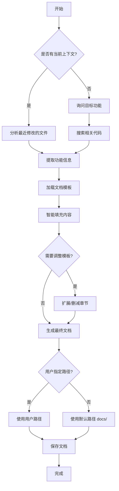

# 功能文档生成器

智能分析当前开发上下文，自动生成结构化的功能说明文档。

## 快速开始

直接说："帮我生成这个功能的文档" 或 "为这个模块写文档"

## 使用说明

### 1. 上下文分析模式（推荐）

当有当前开发上下文时：

1. **自动识别功能范围**：分析最近修改的文件、提交信息和对话历史
2. **智能提取功能信息**：从代码、配置、测试文件中提取关键信息
3. **生成结构化文档**：基于模板自动填充相关章节
4. **智能内容调整**：根据实际功能删减或扩充模板内容

### 2. 指定功能模式

当需要为特定功能生成文档时：

1. **询问用户目标功能**：明确要文档化的功能模块
2. **分析相关代码**：搜索相关的源代码文件
3. **提取关键信息**：识别接口、数据流、配置等
4. **生成定制文档**：基于功能特点调整模板结构

### 3. 文档生成流程



## 执行步骤

### 步骤 1：上下文检测
- 检查 git 状态和最近提交
- 分析最近修改的文件类型（API、模型、配置等）
- 识别功能模块和变更范围

### 步骤 2：信息提取
- **API 端点**：从路由文件提取接口定义
- **数据模型**：从 models.py 提取数据结构
- **配置项**：从配置文件提取可配置参数
- **测试用例**：从测试文件提取功能场景
- **依赖关系**：分析模块间的依赖

### 步骤 3：模板智能适配
- 根据功能类型选择合适的模板章节
- 删除不相关的章节（如无界面则删除界面说明）
- 扩充需要的特殊章节（如性能要求、安全考虑）
- 填充提取到的具体信息

### 步骤 4：文档生成
- 生成符合规范的 Markdown 文档
- 包含完整的表格、代码示例和流程图
- 添加必要的交叉引用和链接

## 输出路径规则

- **用户指定路径**：优先使用用户提供的路径
- **默认路径**：`docs/functional-docs/`
- **文件命名**：`功能名称-v版本号.md`（如：`用户认证-v1.0.md`）

## 模板适配规则

### 自动保留章节
- 文档信息、功能概述、目标范围
- 错误码处理、配置说明、测试验证

### 条件保留章节
- **界面说明**：仅当有前端代码时保留
- **接口定义**：仅当有 API 路由时保留
- **数据库设计**：仅当有数据模型时保留
- **部署运维**：仅当有部署配置时保留

### 智能扩展章节
根据功能特点自动添加：
- 性能指标要求
- 安全控制措施
- 监控告警设置
- 兼容性说明

## 示例

### 上下文模式示例
```
用户：我刚完成了用户认证模块的开发，帮我生成文档
生成：docs/用户认证-v1.0.md
```

### 指定功能模式示例
```
用户：帮订单管理模块生成功能文档
生成：分析订单相关代码 → docs/订单管理-v1.0.md
```

## 最佳实践

- **保持信息同步**：文档应反映最新的代码状态
- **突出关键变更**：在版本记录中明确标注变更内容
- **提供具体示例**：包含实际的请求响应示例
- **考虑使用者**：面向开发人员的技术细节要充分

## 依赖项

- 需要项目使用 git 进行版本控制
- 支持 FastAPI、SQLAlchemy 等常见框架的代码分析
- 要求项目遵循标准目录结构

## 故障排查

**无法识别功能**：
- 检查是否有相关的代码文件
- 确认 git 仓库状态正常

**模板填充不全**：
- 检查代码注释是否充分
- 确认是否遵循了项目的编码规范

**路径创建失败**：
- 检查目录权限
- 确认父目录是否存在