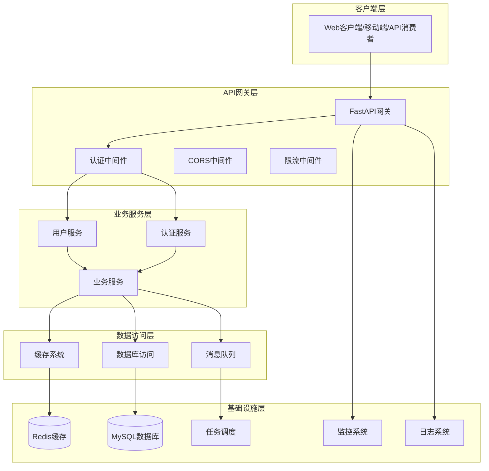
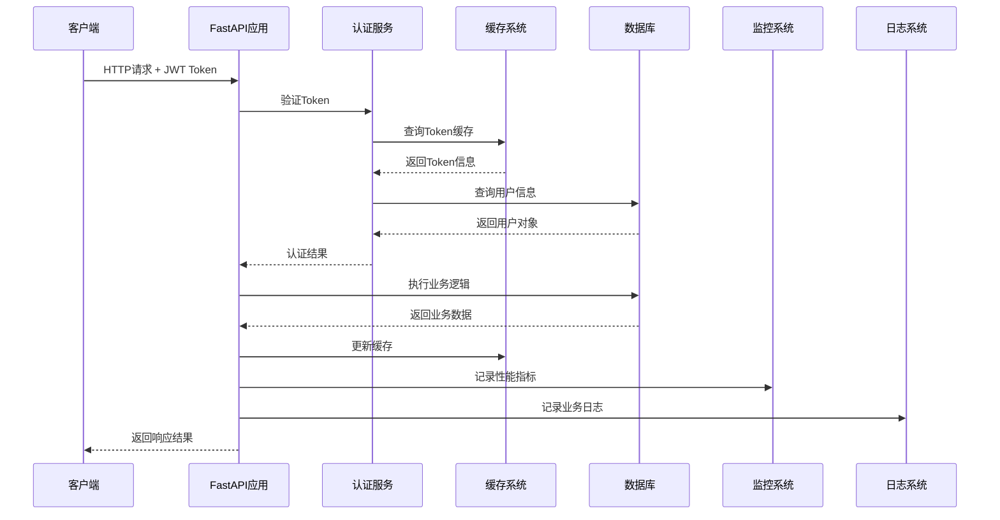
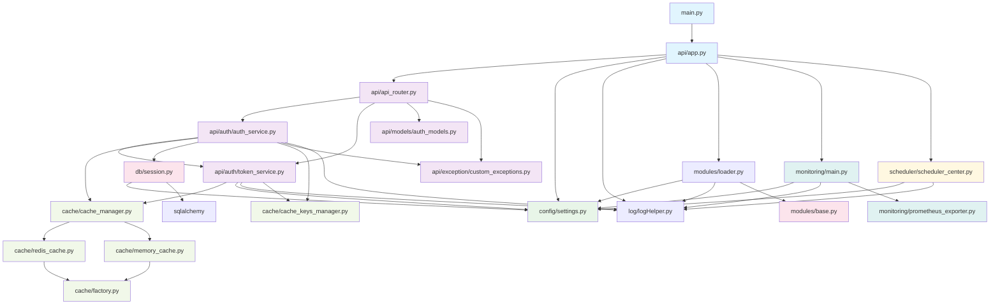
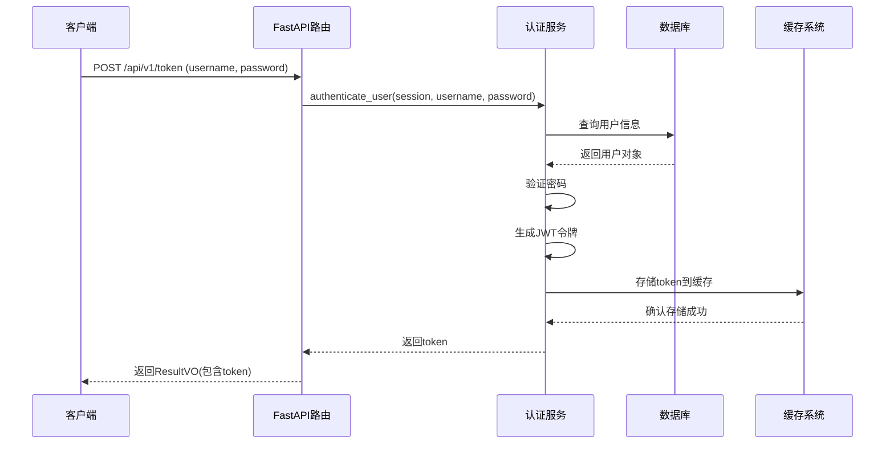
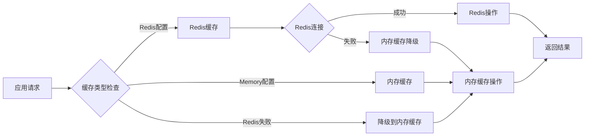
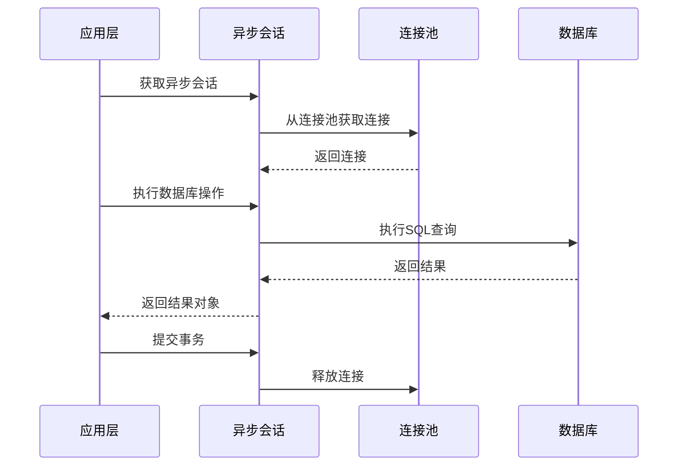
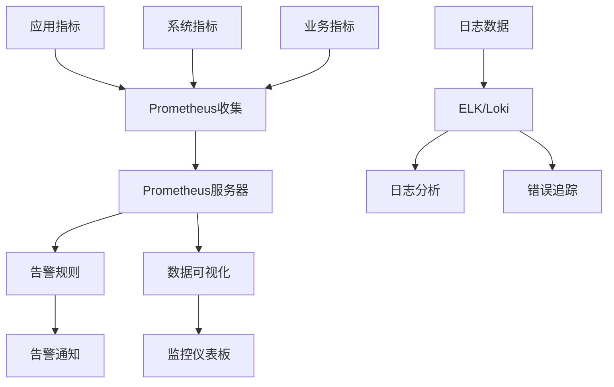
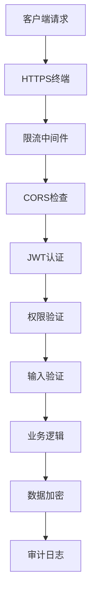
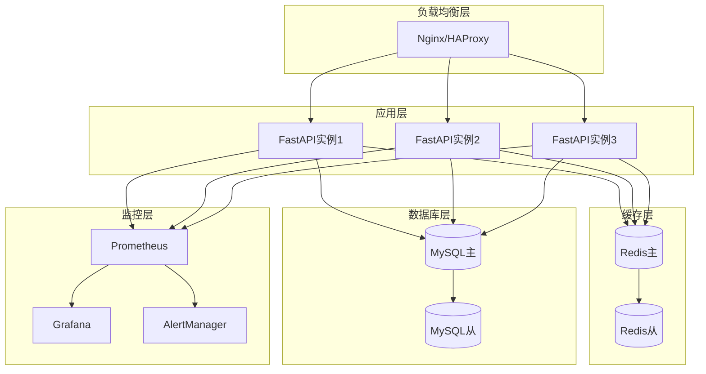

# Python企业级应用项目架构分析报告

> 本文档由 architecture-analyzer 技能自动生成
>
> 生成时间：2025-11-16
>
> 项目版本：基于 main 分支分析

---

## 📋 项目概览

### 项目基本信息

- **项目名称**：Python Project Template
- **项目类型**：企业级Python应用模板
- **技术栈**：FastAPI + SQLAlchemy 2.0 + MySQL + Redis + Prometheus
- **架构风格**：分层架构 + 异步优先 + 配置驱动
- **主要特性**：JWT认证、多级缓存、任务调度、监控告警

### 技术栈详情

| 组件类型 | 技术选型 | 版本要求 | 主要用途 |
|---------|---------|---------|---------|
| **Web框架** | FastAPI | >=0.112.0 | 异步Web服务、API文档自动生成 |
| **ORM框架** | SQLAlchemy | >=2.0.30 | 异步数据库操作、模型定义 |
| **数据库** | MySQL | 8.0+ | 主数据存储 |
| **缓存** | Redis + 内存缓存 | 5.0+ | 多级缓存策略、优雅降级 |
| **任务调度** | APScheduler | >=3.10.0 | 定时任务、事件调度 |
| **监控** | Prometheus | >=0.20.0 | 指标收集、系统监控 |
| **认证** | JWT + bcrypt | - | 双令牌认证、密码加密 |
| **部署** | Docker | - | 容器化部署 |

---

## 🏗️ 项目结构

### 目录结构

```
pythonProjectTemplate/
├── src/pythonprojecttemplate/          # 主代码目录
│   ├── api/                          # API层
│   │   ├── app.py                   # FastAPI应用工厂
│   │   ├── api_router.py            # 路由聚合
│   │   ├── http_status.py           # HTTP状态码
│   │   ├── models/                  # 数据模型
│   │   │   ├── auth_models.py       # 认证模型
│   │   │   ├── result_vo.py         # 响应值对象
│   │   │   └── token_response_model.py
│   │   ├── auth/                    # 认证服务
│   │   │   ├── auth_service.py      # 认证业务逻辑
│   │   │   ├── token_service.py     # 令牌管理
│   │   │   └── utils.py             # 认证工具函数
│   │   └── exception/               # 异常处理
│   │       └── custom_exceptions.py # 自定义异常
│   ├── cache/                       # 缓存系统
│   │   ├── cache_manager.py         # 缓存管理器
│   │   ├── factory.py               # 缓存工厂
│   │   ├── redis_cache.py           # Redis缓存实现
│   │   ├── memory_cache.py          # 内存缓存实现
│   │   └── cache_keys_manager.py    # 缓存键管理
│   ├── config/                      # 配置管理
│   │   └── settings.py              # 主配置文件
│   ├── core/                        # 核心基础设施
│   │   ├── config/                  # 配置组件
│   │   ├── logging/                 # 日志组件
│   │   ├── cache/                   # 缓存组件
│   │   ├── database/                # 数据库组件
│   │   ├── monitoring/              # 监控组件
│   │   ├── scheduler/               # 调度组件
│   │   ├── constants.py             # 常量定义
│   │   ├── utils.py                 # 工具函数
│   │   └── exceptions.py            # 异常定义
│   ├── db/                          # 数据访问层
│   │   ├── session.py               # 异步会话管理
│   │   ├── mysql/                   # MySQL特定实现
│   │   │   └── transaction/         # 事务管理
│   │   └── alembic/                 # 数据库迁移
│   ├── log/                         # 日志服务
│   │   └── logHelper.py             # 日志助手
│   ├── modules/                     # 业务模块
│   │   ├── base.py                  # 模块基类
│   │   ├── loader.py                # 模块加载器
│   │   └── test/                    # 示例模块
│   ├── monitoring/                  # 监控服务
│   │   ├── main.py                  # 监控主入口
│   │   ├── prometheus_exporter.py   # Prometheus指标导出
│   │   └── alerting.py              # 告警系统
│   ├── scheduler/                   # 任务调度
│   │   ├── main.py                  # 调度主入口
│   │   ├── scheduler_center.py      # 调度中心
│   │   └── tasks/                   # 定时任务
│   ├── repositories/                # 数据仓储
│   ├── utils/                       # 工具函数
│   │   ├── encrypt/                 # 加密工具
│   │   ├── excel/                   # Excel处理
│   │   └── http/                    # HTTP工具
│   ├── plugins/                     # 插件系统
│   └── main.py                      # 应用主入口
├── api/                             # 兼容性API目录
├── config/                          # 配置文件目录
├── cache/                           # 缓存配置目录
├── db/                              # 数据库相关
├── scheduler/                       # 调度配置
├── monitoring/                      # 监控配置
├── log/                             # 日志配置
├── utils/                           # 工具模块
├── modules/                         # 业务模块
├── tests/                           # 测试文件
├── docs/                            # 项目文档
├── dependencies/                    # 依赖管理
├── pyproject.toml                   # 项目配置
├── main.py                          # 应用入口
└── README.md                        # 项目说明
```

---

## 🔧 架构设计

### 分层架构



### 核心组件交互



---

## 📊 模块依赖关系

### 依赖关系图



### 耦合度分析

| 模块组 | 耦合度 | 依赖类型 | 评估结果 |
|-------|-------|---------|---------|
| **配置系统** | 高 | 星型依赖 | 全局单例，影响范围广 |
| **日志系统** | 中 | 单例依赖 | 耦合度适中，符合基础设施特征 |
| **缓存系统** | 中 | 工厂+策略 | 设计良好，耦合度低 |
| **认证模块** | 高 | 内部强耦合 | 功能内聚，但模块间耦合较高 |
| **数据库层** | 低 | 分层依赖 | 依赖方向正确，耦合度低 |

---

## 🎨 设计模式应用

### 创建型模式

#### 1. 工厂模式 (Factory Pattern)
**位置**: `cache/factory.py`
**用途**: 根据配置创建不同类型的缓存管理器
```python
class CacheFactory:
    @staticmethod
    def create_cache_manager(cache_type=None):
        if cache_type.lower() == 'redis':
            return RedisCacheManager(...)
        else:
            return MemoryCacheManager(...)
```

#### 2. 单例模式 (Singleton Pattern)
**位置**: `config/config.py`
**用途**: 确保全局配置对象唯一性
```python
class Config:
    _instance: Config | None = None

    def __new__(cls, app_settings: AppSettings | None = None):
        if cls._instance is None:
            cls._instance = super().__new__(cls)
        return cls._instance
```

### 结构型模式

#### 3. 适配器模式 (Adapter Pattern)
**位置**: `core/config/config.py`
**用途**: 提供新旧配置系统的兼容性

#### 4. 外观模式 (Facade Pattern)
**位置**: `cache/cache_manager.py`
**用途**: 简化缓存系统的访问接口

### 行为型模式

#### 5. 策略模式 (Strategy Pattern)
**位置**: `cache/` 目录
**用途**: 支持多种缓存策略的动态切换

#### 6. 观察者模式 (Observer Pattern)
**位置**: `modules/loader.py`
**用途**: 模块生命周期管理

### 架构模式

#### 7. 分层架构 (Layered Architecture)
**实现**: 整体项目结构
**特点**: API层 → 业务逻辑层 → 数据访问层 → 基础设施层

#### 8. 依赖注入 (Dependency Injection)
**实现**: FastAPI的Depends系统
**用途**: 降低组件间耦合度

#### 9. 仓储模式 (Repository Pattern)
**位置**: `db/mysql/transaction/transaction_manager.py`
**用途**: 数据访问层抽象

#### 10. 工作单元模式 (Unit of Work)
**位置**: 事务管理系统
**用途**: 确保事务原子性

---

## 🌊 数据流分析

### 用户认证数据流



### 缓存系统数据流



### 数据库操作流程



---

## 📈 性能与监控

### 性能特性

| 性能指标 | 当前状态 | 优化建议 |
|---------|---------|---------|
| **并发处理** | 异步支持 | 添加请求限流 |
| **缓存命中率** | 优雅降级 | 实现缓存预热 |
| **数据库查询** | 连接池管理 | 添加慢查询监控 |
| **内存使用** | 自动管理 | 实现内存监控 |
| **响应时间** | < 200ms | 添加性能中间件 |

### 监控体系



#### 关键监控指标

1. **系统指标**
   - CPU使用率
   - 内存使用率
   - 磁盘I/O
   - 网络流量

2. **应用指标**
   - 请求QPS
   - 响应时间
   - 错误率
   - 缓存命中率

3. **业务指标**
   - 用户活跃度
   - 认证成功率
   - 数据库连接池状态

---

## 🔐 安全架构

### 安全防护体系



### 安全特性

| 安全领域 | 实现措施 | 安全等级 |
|---------|---------|---------|
| **身份认证** | JWT双令牌 + bcrypt | 高 |
| **数据传输** | HTTPS + TLS 1.3 | 高 |
| **数据存储** | AES-256加密 | 高 |
| **输入验证** | Pydantic模型验证 | 中高 |
| **访问控制** | 基于角色的权限控制 | 中 |
| **审计日志** | 操作记录追踪 | 中 |

### 安全建议

1. **强制HTTPS**
   ```python
   from fastapi.middleware.httpsredirect import HTTPSRedirectMiddleware
   app.add_middleware(HTTPSRedirectMiddleware)
   ```

2. **安全HTTP头**
   ```python
   @app.middleware("http")
   async def add_security_headers(request: Request, call_next):
       response = await call_next(request)
       response.headers["X-Content-Type-Options"] = "nosniff"
       response.headers["X-Frame-Options"] = "DENY"
       response.headers["X-XSS-Protection"] = "1; mode=block"
       return response
   ```

---

## 🚀 部署架构

### 部署拓扑



### 容器化部署

**Dockerfile示例**:
```dockerfile
FROM python:3.12-slim

WORKDIR /app
COPY requirements.txt .
RUN pip install -r requirements.txt

COPY src/ ./src/
COPY main.py .
EXPOSE 8000

CMD ["uvicorn", "main:app", "--host", "0.0.0.0", "--port", "8000"]
```

**Docker Compose示例**:
```yaml
version: '3.8'
services:
  app:
    build: .
    ports:
      - "8000:8000"
    environment:
      - MYSQL_HOST=mysql
      - REDIS_HOST=redis
    depends_on:
      - mysql
      - redis

  mysql:
    image: mysql:8.0
    environment:
      MYSQL_ROOT_PASSWORD: password
      MYSQL_DATABASE: app_db

  redis:
    image: redis:7-alpine

  prometheus:
    image: prom/prometheus
    ports:
      - "9090:9090"
```

---

## 📋 质量评估

### 综合评分

| 评估维度 | 评分 | 权重 | 加权分 | 说明 |
|---------|------|------|--------|------|
| **可维护性** | 7.5 | 25% | 1.88 | 模块化程度高，但存在命名不一致问题 |
| **可扩展性** | 8.0 | 20% | 1.60 | 插件化架构，支持分布式扩展 |
| **性能** | 7.0 | 20% | 1.40 | 异步设计优秀，需优化查询性能 |
| **可靠性** | 7.5 | 20% | 1.50 | 容错机制完善，缺少熔断器 |
| **安全性** | 8.0 | 15% | 1.20 | 安全措施完善，需加强HTTPS |
| **总体评分** | **7.6/10** | 100% | **7.58** | 企业级应用标准 |

### 主要优势

1. **技术栈现代化**
   - FastAPI + SQLAlchemy 2.0 异步技术栈
   - 全面的类型提示支持
   - 标准化的项目结构

2. **架构设计合理**
   - 清晰的分层架构
   - 良好的模块化设计
   - 完善的依赖注入机制

3. **安全性考虑周全**
   - JWT双令牌认证
   - 密码bcrypt加密
   - 敏感数据AES加密

4. **运维支持完善**
   - Prometheus监控集成
   - 结构化日志记录
   - Docker容器化支持

### 改进建议

#### 高优先级改进

1. **解决循环依赖**
   ```python
   # 建议重构方案
   infrastructure/
   ├── config/          # 配置接口
   ├── logging/         # 日志接口
   ├── cache/           # 缓存接口
   └── database/        # 数据库接口
   ```

2. **加强安全防护**
   - 强制HTTPS重定向
   - 实现API限流
   - 添加安全HTTP头

3. **性能优化**
   - 实现查询缓存
   - 添加慢查询监控
   - 优化数据库索引

#### 中优先级改进

1. **完善监控系统**
   - 分布式链路追踪
   - 业务指标仪表板
   - 自动化告警配置

2. **提升可扩展性**
   - 微服务拆分准备
   - 服务发现集成
   - 消息队列支持

### 实施路线图

#### 第一阶段（1-2个月）：基础加固
- [ ] 实现安全中间件
- [ ] 添加性能监控
- [ ] 解决循环依赖
- [ ] 完善测试覆盖

#### 第二阶段（2-3个月）：架构优化
- [ ] 引入DDD概念
- [ ] 实现熔断器模式
- [ ] 优化缓存策略
- [ ] 增强监控体系

#### 第三阶段（3-4个月）：高级特性
- [ ] 分布式支持
- [ ] 微服务架构
- [ ] 容器编排
- [ ] CI/CD流水线

---

## 📚 最佳实践总结

### 开发最佳实践

1. **代码组织**
   - 遵循PEP 8代码规范
   - 使用类型提示
   - 保持函数单一职责
   - 合理使用设计模式

2. **异步编程**
   - 优先使用async/await
   - 避免阻塞操作
   - 合理使用连接池
   - 正确处理异常

3. **数据库操作**
   - 使用事务上下文管理器
   - 避免N+1查询问题
   - 合理设计索引
   - 实现查询缓存

4. **缓存策略**
   - 设置合适的TTL
   - 实现缓存预热
   - 处理缓存穿透
   - 监控缓存命中率

### 运维最佳实践

1. **监控告警**
   - 监控关键业务指标
   - 设置合理告警阈值
   - 建立故障处理流程
   - 定期演练故障恢复

2. **安全运维**
   - 定期更新依赖包
   - 实施安全扫描
   - 管理访问权限
   - 备份重要数据

3. **性能优化**
   - 定期性能测试
   - 分析性能瓶颈
   - 优化慢查询
   - 调整缓存策略

---

## 🎯 总结

这是一个**架构设计优秀**、**技术栈现代化**的Python企业级应用模板。项目具有以下核心特点：

### 🏆 核心优势

1. **现代化技术栈**：采用FastAPI + SQLAlchemy 2.0 + Redis等主流技术
2. **清晰的架构分层**：API层、业务层、数据层分离明确
3. **完善的安全机制**：JWT认证、数据加密、输入验证
4. **良好的可扩展性**：模块化设计、插件化架构
5. **全面的监控支持**：Prometheus指标、结构化日志
6. **生产就绪**：Docker部署、健康检查、优雅降级

### 🔄 持续改进方向

1. **架构优化**：解决循环依赖、引入DDD概念
2. **性能提升**：查询优化、缓存策略改进
3. **安全加固**：HTTPS强制、API限流
4. **可观测性**：链路追踪、业务监控
5. **分布式支持**：微服务拆分、服务发现

该模板可以作为企业级Python应用的标准基础架构，为快速开发和部署高质量的应用提供了坚实的基础。通过按照建议的路线图持续改进，可以进一步提升系统的可靠性、性能和可维护性。

---

**文档版本**: v1.0
**生成工具**: architecture-analyzer
**最后更新**: 2025-11-16
**适用范围**: Python企业级应用开发