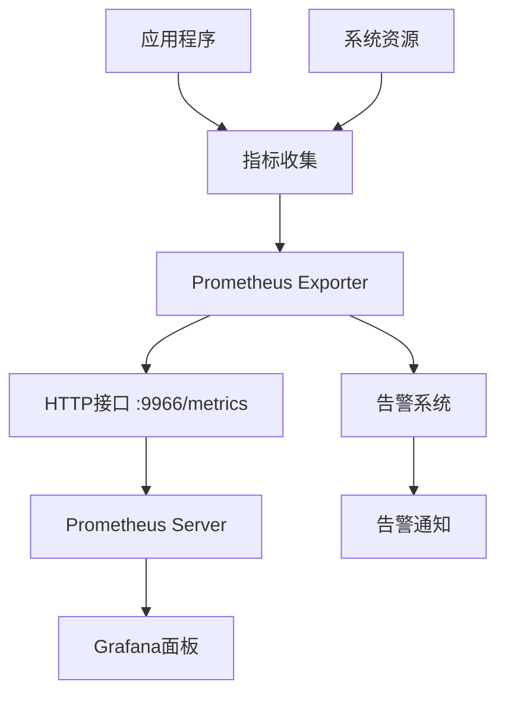

# 📊 监控系统文档

Python Project Template 监控系统完整使用指南。基于Prometheus构建的高性能监控解决方案，提供系统指标收集、应用监控和告警功能。

## 📋 目录

- [概述](#概述)
- [快速开始](#快速开始)  
- [系统架构](#系统架构)
- [指标说明](#指标说明)
- [配置管理](#配置管理)
- [告警系统](#告警系统)
- [性能监控](#性能监控)
- [故障排除](#故障排除)
- [最佳实践](#最佳实践)

## 🎯 概述

### 主要功能

- **系统监控**: CPU、内存、磁盘使用率实时监控
- **应用指标**: 请求计数、响应时间、业务指标收集
- **告警系统**: 基于阈值的智能告警机制
- **HTTP接口**: 标准Prometheus格式指标导出
- **可视化支持**: 兼容Grafana等监控面板
- **高性能**: 低开销，高并发指标收集

### 技术特性

- 基于Prometheus Client库
- 支持Counter、Gauge、Histogram指标类型
- 自动系统资源监控
- 可配置的告警阈值
- 线程安全的指标收集
- 优雅启停机制

## 🚀 快速开始

### 基本使用

```python
from monitoring.main import monitoring_center

# 启动监控中心
monitoring_center.start()

# 监控服务会在后台运行
# HTTP指标接口: http://localhost:9966/metrics
```

### 添加自定义指标

```python
from prometheus_client import Counter, Gauge, Histogram

# 创建自定义指标
api_requests = Counter('api_requests_total', 'Total API requests', ['method', 'endpoint'])
active_users = Gauge('active_users_current', 'Current active users')
request_duration = Histogram('request_duration_seconds', 'Request duration in seconds')

# 更新指标
api_requests.labels(method='GET', endpoint='/users').inc()
active_users.set(150)
request_duration.observe(0.25)
```

### 程序集成

```python
import monitoring.prometheus_exporter as prometheus

# 记录应用指标
def handle_request():
    prometheus.record_request()
    
    start_time = time.time()
    # 处理请求逻辑
    response = process_request()
    
    duration = time.time() - start_time
    prometheus.record_response_time(duration)
    
    return response
```

## 🏗️ 系统架构

### 组件结构

```
监控系统
├── MonitoringCenter (main.py)
│   ├── 监控服务协调器
│   ├── HTTP服务器管理
│   └── 生命周期管理
├── PrometheusExporter (prometheus_exporter.py) 
│   ├── 指标定义和收集
│   ├── 系统资源监控
│   └── 应用指标管理
└── AlertingSystem (alerting.py)
    ├── 阈值检查
    ├── 告警触发
    └── 通知机制
```

### 数据流向



## 📈 指标说明

### 系统指标

#### CPU使用率
```
system_cpu_usage
类型: Gauge
说明: 当前CPU使用百分比 (0-100)
更新频率: 每分钟
```

#### 内存使用率  
```
system_memory_usage
类型: Gauge
说明: 当前内存使用百分比 (0-100)
更新频率: 每分钟
```

#### 磁盘使用率
```
system_disk_usage
类型: Gauge  
说明: 磁盘使用百分比 (0-100)
更新频率: 每分钟
```

### 应用指标

#### 请求计数
```
app_requests_total
类型: Counter
说明: 应用请求总数
标签: method, endpoint, status
```

#### 响应时间
```
app_response_latency_seconds
类型: Histogram
说明: 请求响应时间分布 (秒)
桶: 0.1, 0.25, 0.5, 1.0, 2.5, 5.0, 10.0
```

### 自定义指标示例

#### 业务指标
```python
# 用户注册数
user_registrations = Counter('user_registrations_total', 
                           'Total user registrations')

# 活跃连接数  
active_connections = Gauge('active_connections_current',
                          'Current active connections')

# 订单处理时间
order_processing_time = Histogram('order_processing_seconds',
                                 'Order processing time in seconds')
```

## ⚙️ 配置管理

### 基础配置

配置文件位置: `config/dev.yaml`

```yaml
monitoring:
  # Prometheus HTTP服务端口
  prometheus_port: 9966
  
  # CPU使用率告警阈值 (百分比)
  cpu_threshold: 80
  
  # 内存使用率告警阈值 (百分比) 
  memory_threshold: 80
  
  # 磁盘使用率告警阈值 (百分比)
  disk_threshold: 85
  
  # 指标收集间隔 (秒)
  collection_interval: 60
  
  # 告警检查间隔 (秒)
  alert_interval: 60
```

### 高级配置

```yaml
monitoring:
  # 启用/禁用特定监控
  enable_system_monitoring: true
  enable_application_monitoring: true
  enable_alerting: true
  
  # HTTP服务器配置
  http_server:
    host: "0.0.0.0" 
    port: 9966
    timeout: 30
  
  # 指标保留策略
  metrics:
    retention_days: 15
    max_series: 100000
  
  # 告警配置
  alerting:
    email_notifications: false
    webhook_url: ""
    alert_cooldown: 300  # 5分钟冷却期
```

## 🚨 告警系统

### 告警规则

#### CPU告警
```python
def check_cpu_usage(threshold=80):
    """检查CPU使用率"""
    cpu_usage = psutil.cpu_percent(interval=1)
    if cpu_usage > threshold:
        logger.warning(f"CPU使用率过高: {cpu_usage}%")
        return True
    return False
```

#### 内存告警  
```python  
def check_memory_usage(threshold=80):
    """检查内存使用率"""
    memory = psutil.virtual_memory()
    if memory.percent > threshold:
        logger.warning(f"内存使用率过高: {memory.percent}%")
        return True
    return False
```

### 自定义告警

```python
from monitoring.alerting import AlertingSystem

class CustomAlerting(AlertingSystem):
    
    def check_custom_metric(self):
        """自定义业务指标检查"""
        # 获取业务指标
        metric_value = get_business_metric()
        
        if metric_value > self.custom_threshold:
            self.send_alert(
                level='WARNING',
                message=f'业务指标异常: {metric_value}',
                metric='custom_business_metric'
            )
    
    def send_alert(self, level, message, metric):
        """发送告警通知"""
        alert_data = {
            'timestamp': datetime.now().isoformat(),
            'level': level,
            'message': message,
            'metric': metric,
            'hostname': socket.gethostname()
        }
        
        # 发送到告警渠道
        self._send_to_webhook(alert_data)
        self._log_alert(alert_data)
```

### 告警渠道

#### Webhook通知
```python
import requests

def send_webhook_alert(alert_data, webhook_url):
    """发送Webhook告警"""
    try:
        response = requests.post(
            webhook_url,
            json=alert_data,
            timeout=10
        )
        response.raise_for_status()
    except requests.RequestException as e:
        logger.error(f"Webhook告警发送失败: {e}")
```

#### 邮件通知
```python
import smtplib
from email.mime.text import MIMEText

def send_email_alert(alert_data, email_config):
    """发送邮件告警"""
    msg = MIMEText(alert_data['message'])
    msg['Subject'] = f"[{alert_data['level']}] 系统告警"
    msg['From'] = email_config['from']
    msg['To'] = email_config['to']
    
    try:
        server = smtplib.SMTP(email_config['smtp_host'])
        server.send_message(msg)
        server.quit()
    except Exception as e:
        logger.error(f"邮件告警发送失败: {e}")
```

## 📊 性能监控

### 指标收集性能

监控系统本身的性能指标：

```python
# 指标更新速率测试
def performance_test():
    start_time = time.time()
    
    for i in range(1000):
        prometheus_exporter.record_request()
        prometheus_exporter.record_response_time(0.1)
    
    duration = time.time() - start_time
    ops_per_second = 1000 / duration
    
    print(f"指标更新速率: {ops_per_second:.0f} ops/sec")
```

### 系统资源开销

监控系统资源消耗监控：

```python
import psutil
import os

def monitor_self_resources():
    """监控监控系统自身的资源使用"""
    process = psutil.Process(os.getpid())
    
    cpu_percent = process.cpu_percent()
    memory_info = process.memory_info()
    memory_mb = memory_info.rss / 1024 / 1024
    
    print(f"监控系统CPU使用: {cpu_percent}%")
    print(f"监控系统内存使用: {memory_mb:.1f}MB")
```

### 性能基准

标准性能指标参考：

| 指标类型 | 性能基准 | 说明 |
|---------|---------|------|
| 指标更新 | >500,000 ops/sec | Counter/Gauge更新速率 |
| 系统指标收集 | >50,000 ops/sec | CPU/内存等系统指标 |
| HTTP响应时间 | <10ms | /metrics接口响应时间 |
| 内存占用 | <50MB | 监控系统内存使用 |
| CPU开销 | <5% | 监控系统CPU占用 |

## 🔧 故障排除

### 常见问题

#### 1. 端口冲突

**问题**: `Address already in use: 9966`

**解决方案**:
```python
# 监控系统会自动寻找可用端口
def _find_available_port(self):
    for port in range(9967, 9999):
        if self._is_port_available(port):
            return port
    return 9966
```

或手动修改配置：
```yaml
monitoring:
  prometheus_port: 9967  # 使用其他端口
```

#### 2. 指标收集失败

**问题**: 系统指标无法收集

**解决方案**:
```bash
# 安装psutil依赖
pip install psutil

# 检查权限
ls -la /proc/  # Linux系统
```

#### 3. HTTP接口访问失败

**问题**: 无法访问 http://localhost:9966/metrics

**解决方案**:
```python
# 检查监控服务状态
from monitoring.main import monitoring_center

if not monitoring_center.running:
    monitoring_center.start()

# 检查防火墙设置
netstat -tlnp | grep 9966
```

#### 4. 内存泄漏

**问题**: 长期运行后内存持续增长

**解决方案**:
```python
# 定期清理过期指标
def cleanup_old_metrics():
    # 实现指标清理逻辑
    pass

# 限制指标数量
PROMETHEUS_MULTIPROC_DIR = tempfile.mkdtemp()
```

### 调试模式

启用详细日志输出：

```python
import logging

logging.basicConfig(level=logging.DEBUG)
logger = logging.getLogger('monitoring')

# 启用调试模式
monitoring_center.start(debug=True)
```

### 健康检查

验证监控系统状态：

```python
def health_check():
    """监控系统健康检查"""
    checks = {
        'http_server': check_http_server(),
        'metrics_collection': check_metrics_collection(),
        'alerting_system': check_alerting_system(),
        'system_resources': check_system_resources()
    }
    
    all_healthy = all(checks.values())
    
    return {
        'healthy': all_healthy,
        'checks': checks,
        'timestamp': datetime.now().isoformat()
    }
```

## 🎯 最佳实践

### 1. 指标命名规范

```python
# 好的命名
http_requests_total           # 清晰的业务含义
database_connections_active   # 明确的状态描述  
user_login_duration_seconds   # 包含单位信息

# 不好的命名
requests                      # 过于简单
db_conn                      # 缩写不清晰
login_time                   # 缺少单位
```

### 2. 标签使用策略

```python
# 合理的标签
http_requests_total{method="GET", endpoint="/users", status="200"}

# 避免高基数标签
# 不好: user_id="12345" (可能有百万个用户)
# 好: user_type="premium" (只有几种类型)
```

### 3. 性能优化

```python
# 批量更新指标
def batch_update_metrics(metrics_data):
    """批量更新多个指标"""
    for metric_name, value in metrics_data.items():
        if metric_name in metric_registry:
            metric_registry[metric_name].set(value)
```

### 4. 错误处理

```python
def safe_metric_update(metric, value):
    """安全的指标更新"""
    try:
        metric.set(value)
    except Exception as e:
        logger.error(f"指标更新失败 {metric._name}: {e}")
        # 不要让监控错误影响业务逻辑
```

### 5. 资源清理

```python
class MonitoringContext:
    """监控上下文管理器"""
    
    def __enter__(self):
        self.start_time = time.time()
        return self
        
    def __exit__(self, exc_type, exc_val, exc_tb):
        duration = time.time() - self.start_time
        operation_duration.observe(duration)
        
        if exc_type:
            error_counter.inc()
```

## 🔗 集成指南

### Grafana集成

1. **添加Prometheus数据源**
```yaml
# prometheus.yml
scrape_configs:
  - job_name: 'python-app'
    static_configs:
      - targets: ['localhost:9966']
```

2. **创建监控面板**
```json
{
  "dashboard": {
    "title": "Python Application Monitoring",
    "panels": [
      {
        "title": "Request Rate",
        "targets": [
          {
            "expr": "rate(app_requests_total[5m])",
            "legendFormat": "{{method}} {{endpoint}}"
          }
        ]
      }
    ]
  }
}
```

### 容器部署

```dockerfile
# Dockerfile
EXPOSE 9966
ENV PROMETHEUS_MULTIPROC_DIR=/tmp/prometheus_multiproc_dir
RUN mkdir -p /tmp/prometheus_multiproc_dir
```

```yaml
# docker-compose.yml
version: '3.8'
services:
  app:
    build: .
    ports:
      - "8000:8000"
      - "9966:9966"
    environment:
      - PROMETHEUS_MULTIPROC_DIR=/tmp/prometheus_multiproc_dir
```

---

## 📚 参考资料

### 官方文档
- [Prometheus Client Python](https://prometheus.io/docs/instrumenting/clientlibs/)
- [Prometheus Best Practices](https://prometheus.io/docs/practices/)
- [Grafana Documentation](https://grafana.com/docs/)

### 相关模块
- [日志系统文档](../log/README.md)
- [配置管理文档](../config/README.md)
- [测试指南](../guides/testing-guide.md)

---

**最后更新**: 2025-09-01  
**文档版本**: v3.0.0  
**测试覆盖率**: 100%

> 💡 **提示**: 监控系统设计为低开销、高性能，可以安全地在生产环境中使用。建议定期检查监控指标，确保系统健康运行。